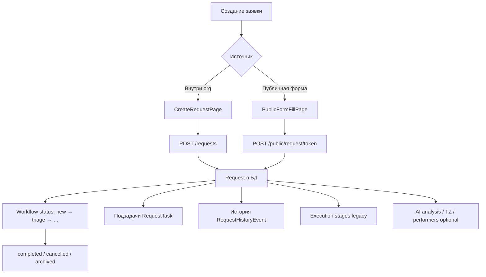

# СВОД — обзор проекта, стек и бизнес-логика

Дата: 2026-06-15

Единый справочник по продукту, архитектуре и ключевым потокам.  
Детальные правила разработки — в `DEVELOPMENT_RULES.md`, `FRONTEND_RULES.md`, `BACKEND_RULES.md`, `API_RULES.md`.

---

## 1. Назначение продукта

**СВОД** — B2B SaaS для сбора, структурирования и обработки заявок внутри организаций.

Целевая аудитория: маркетологи, продакты, внутренние команды, которым нужно централизованно принимать запросы от коллег, партнёров и клиентов.

### Основные разделы UI (авторизованная зона)

| Раздел | Маршрут | Назначение |
|--------|---------|------------|
| Заявки | `/requests` | Список, создание, карточка заявки |
| Формы | `/forms` | Конструктор и управление шаблонами |
| Участники | `/participants` | Члены организации, приглашения |
| Настройки организации | `/settings/organization` | Профиль org, публичные ссылки |

### Публичная зона (без авторизации)

| Маршрут | Назначение |
|---------|------------|
| `/auth` | Вход и регистрация |
| `/form/:token` | Лендинг публичной формы |
| `/form/:token/fill/:formId` | Заполнение и отправка заявки |

---

## 2. Технологический стек

### Frontend

| Слой | Технология |
|------|------------|
| Runtime | React 19, TypeScript 5.9 |
| Bundler | Vite 7 |
| UI | Ant Design 6, `@ant-design/icons` |
| Routing | React Router 7 (`createBrowserRouter`) |
| HTTP | axios (единый клиент) |
| DnD (конструктор форм) | `@dnd-kit/*` |
| Иконки полей | `@iconify/react` |
| Даты | `dayjs` |
| Formily (эксперимент) | `@formily/*` — dev-страница `/dev/formily-builder` |
| Стили | `brand-tokens.css`, `index.css`, CSS-переменные `--app-*` |

**Команды:**

```bash
npm run dev      # локальная разработка
npm run lint     # ESLint (0 ошибок, 0 warnings)
npm run build    # tsc -b && vite build
npm run preview  # preview production build
```

### Backend

| Слой | Технология |
|------|------------|
| Framework | FastAPI |
| ORM | SQLAlchemy async + asyncpg |
| БД | PostgreSQL 16 |
| Миграции | Alembic |
| Auth | JWT (`python-jose`) + bcrypt |
| AI (опционально) | GigaChat API |
| Entry point | `backend/app/main.py` |

### Инфраструктура

| Среда | Как запускается |
|-------|-----------------|
| Локальная разработка | `npm run dev` + `backend/docker-compose.yml` (db + api) |
| Production | `docker-compose.production.yml` (db, api, frontend, nginx) |

**Env frontend:** `VITE_API_URL` — обязателен.  
**Env backend:** `DATABASE_URL`, `SECRET_KEY`, `CORS_ORIGINS` и др. — см. `backend/.env.example`.

---

## 3. Архитектурные границы

### Frontend (`src/`)

```
src/
  pages/              # экраны уровня маршрута
  components/         # layout, domain UI (request, organization, …)
  shared/
    api/              # HTTP-модули по сущностям (единственное место API-вызовов)
    lib/api.ts        # единственный authenticated axios-клиент
    context/          # Theme, Auth, Organization, Notifications
    hooks/            # useAuth, useOrganization, form store
    ui/               # переиспользуемые компоненты, form-builder
    config/           # feature flags
    utils/            # чистые хелперы
  types/              # доменные TS-типы
  assets/             # логотип, favicon
```

**Правила:**

- Импорты — только относительные пути (без `@/` alias).
- API-вызовы — только из `src/shared/api/`.
- UI-строки — на русском.

### Backend (`backend/app/`)

```
routes/  →  services/  →  repositories/  →  models/
schemas/ — Pydantic DTO
core/    — config, database, security
constants/ — словари статусов, переходов, прав
```

**Правило:** routes тонкие; бизнес-логика в services; доступ к БД в repositories.

### Запрещено без отдельной задачи

- **Carbon**, **Supabase**, **zustand**
- Второй authenticated axios-клиент
- Изменение auth flow (JWT + `localStorage.access_token`)
- Изменение маршрутов `App.tsx` и backend endpoints без согласования
- Forgot-password / reset-password (не реализовано)

---

## 4. Доменные сущности

| Сущность | Описание | Ключевые поля / связи |
|----------|----------|------------------------|
| **User** | Аккаунт | email, пароль (hash), ФИО |
| **Organization** | Рабочее пространство | name, owner |
| **OrganizationMember** | Участник org | `role_tag`: `owner` \| `member` |
| **OrganizationInvitation** | Приглашение в org | email, статус, invited_user |
| **Form** | Шаблон полей заявки | `schema` (JSON), `organization_id`, `archived` |
| **Request** | Заявка | `data` (ответы), `form_id`, `organization_id`, статусы |
| **FormFile** | Вложение к заявке | привязка к request и полю формы |
| **PublicRequestLink** | Публичная ссылка | token → набор форм org |
| **RequestStage** | Этап исполнения (legacy execution) | sequence, status, assignee |
| **RequestExecutionEvent** | События исполнения | assign, complete, block, … |
| **RequestTask** | Подзадача заявки | title, status, assignee, priority |
| **RequestHistoryEvent** | История изменений | тип события, payload, actor |
| **ExternalContractor** | Внешний исполнитель | для assign / stages |
| **PerformerSelectionAnalytics** | Аналитика подбора исполнителей | AI matching |

---

## 5. Аутентификация и сессия

### Поток

1. `POST /auth/register` или `POST /auth/login` → JWT `access_token`.
2. Frontend сохраняет токен в `localStorage.access_token`.
3. Axios interceptor добавляет `Authorization: Bearer <token>` ко всем запросам.
4. `GET /auth/me` — профиль текущего пользователя.
5. При **401** — токен удаляется, редирект на `/auth`.

### Защита маршрутов (frontend)

- `ProtectedLayout` — проверяет `useAuth()`; без user → `/auth`.
- `PublicOnlyAuthPage` — если уже залогинен → `/requests`.

### Контекст организации

- `OrganizationProvider` загружает `GET /organizations/my`.
- Без организации — экран «Создать организацию».
- Переключение org влияет на фильтрацию заявок/форм (через `organization_id` в API).

### Права (упрощённо)

| Действие | Кто может |
|----------|-----------|
| Управление org, приглашения | `owner` |
| Работа с заявками org | любой `member` с доступом к org |
| Workflow-статусы заявки | `owner` (manager) |
| Статус своей подзадачи | assignee подзадачи |
| CRUD подзадач | `owner` |

Константа менеджеров: `MANAGER_ROLE_TAGS = {"owner"}` (`backend/app/constants/request_workflow.py`).

---

## 6. Заявки (Request) — две параллельные модели статусов

У заявки есть **два независимых слоя** статусов.

### 6.1. Legacy: `status` + execution stages

| Поле | Значения | Назначение |
|------|----------|------------|
| `status` | `open`, `assigned`, `closed` | Простой жизненный цикл |
| `execution_status` | `new`, `in_progress`, `waiting`, `blocked`, `completed` | Кэш derived от этапов |
| `RequestStage` | pending → in_progress → done / blocked / … | Последовательные этапы исполнения |

**API (execution):**

- `GET/POST /requests/{id}/stages`
- `POST …/stages/{id}/assign|complete|block|unblock`
- `GET /requests/{id}/execution-events`
- `POST /requests/{id}/assign` — назначение исполнителя (internal/external)

**UI:** `RequestExecutionPanel`, `AssignPerformerModal`, `PerformerSelectionBlock`.

### 6.2. Workflow: `workflow_status` + подзадачи + история

| Поле | Значения |
|------|----------|
| `workflow_status` | `draft` → `new` → `triage` → `in_progress` → `review` → `completed` / `cancelled` / `archived` |
| `priority` | `low`, `medium`, `high`, `urgent` |
| `due_date`, `responsible_user_id` | срок и ответственный (поле есть, UI частично) |

**Переходы** — строго по графу `WORKFLOW_TRANSITIONS` (`backend/app/constants/request_workflow.py`).

**Подзадачи (`RequestTask`):**

- Статусы: `todo`, `in_progress`, `blocked`, `review`, `done`, `cancelled`
- CRUD: `GET/POST/PATCH/DELETE /requests/{id}/tasks`
- Смена статуса: `PATCH …/tasks/{task_id}/status`
- Назначение: `PATCH …/tasks/{task_id}/assignee` (из участников org)

**История (`RequestHistoryEvent`):**

- `GET /requests/{id}/history`
- События: создание/обновление заявки, смена статуса, CRUD подзадач, завершение

**UI:** `RequestWorkflowStatusControl`, `RequestTasksPanel`, `RequestHistoryTimeline` (вкладки на `RequestViewPage`).

### 6.3. Общие операции с заявкой

| Операция | Endpoint |
|----------|----------|
| Список | `GET /requests?organization_id=…` |
| Счётчики | `GET /requests/counts` |
| Детали | `GET /requests/{id}` |
| Создание | `POST /requests` |
| Обновление | `PUT /requests/{id}` |
| Legacy status | `PATCH /requests/{id}/status` |
| Workflow status | `PATCH /requests/{id}/workflow-status` |
| Подсказка workflow | `GET /requests/{id}/workflow-suggestion` |
| Мягкое удаление | `DELETE /requests/{id}` (`deleted=true`) |

**Данные заявки:**

- `data` — JSONB с ответами на поля формы
- `form_snapshot` — снимок схемы формы на момент создания
- `applicant_*` — данные заявителя (для публичных заявок)
- `source` — источник (`internal`, `public`, …)

---

## 7. Формы и конструктор

### Модель Form

- `schema` — JSON-описание полей (типы, labels, validation, options).
- Привязка к `organization_id`.
- Флаг `archived` — скрытие из активного списка.

### Конструктор (form-builder)

Расположение: `src/shared/ui/form-builder/`.

Компоненты:

- `FormEditor` — редактор с drag-and-drop (`@dnd-kit`)
- `FormCanvas`, `DroppedFieldCard`, `FieldRenderer`, `FieldPreview`
- Типы полей: text, textarea, select, checkbox, date, file, address (Яндекс.Карты), group и др.
- `FormPreviewModal` — предпросмотр и тестовое заполнение
- Валидация: `fieldValueValidation.ts`, `formRules.ts`, `schemaMapper.ts`

### CRUD форм

| Операция | Endpoint |
|----------|----------|
| Список | `GET /forms?organization_id=…` |
| Детали | `GET /forms/{id}` |
| Создание | `POST /forms` |
| Обновление | `PUT /forms/{id}` |
| Удаление | `DELETE /forms/{id}` |

### Заполнение формы (создание заявки)

- **Внутри org:** `CreateRequestPage` — выбор формы → wizard заполнения → `POST /requests`.
- **Публично:** `PublicFormFillPage` → `POST /public/request/{token}`.

---

## 8. Организации и участники

### API

| Группа | Endpoints |
|--------|-----------|
| Org CRUD | `POST/GET/PATCH/DELETE /organizations` |
| Мои org | `GET /organizations/my` |
| Участники | `GET/DELETE/PATCH /organizations/{id}/members` |
| Приглашения | `POST/GET …/invitations`, accept/decline |
| Публичная ссылка | `POST/GET …/public-link` |
| Выход из org | `POST …/leave` |

### Потоки

1. **Создание org** — модалка `CreateOrganizationModal` → пользователь становится `owner`.
2. **Приглашение** — `InviteMemberModal` → email → accept/decline.
3. **Переключение org** — `OrganizationSwitcher` в sidebar.

---

## 9. Публичные формы

### Поток

1. Owner создаёт `PublicRequestLink` (token) для org.
2. Внешний пользователь открывает `/form/:token`.
3. `GET /public/request/{token}` — данные лендинга (org, доступные формы).
4. Опционально: `POST …/suggest-forms` — AI-подсказка формы по описанию.
5. Заполнение → `POST /public/request/{token}` — создаётся Request с `source=public`.

**Важно:** публичные запросы идут через отдельный `publicApi` без Bearer-токена (`public.api.ts`).

---

## 10. Файлы

| Операция | Endpoint |
|----------|----------|
| Список файлов заявки | `GET /requests/{id}/files` |
| Загрузка | `POST /requests/{id}/files` (multipart) |
| Удаление | `DELETE /files/{file_id}` |

Frontend: `files.api.ts`, дедупликация в `fileUpload.utils.ts`.

---

## 11. AI-возможности (опциональные)

Интеграция с **GigaChat** на backend. На frontend управляются **feature flags** (`src/shared/config/featureFlags.ts`):

| Flag | Env | По умолчанию |
|------|-----|--------------|
| `requestAssistant` | `VITE_ENABLE_REQUEST_ASSISTANT` | включён (`!== 'false'`) |
| `executorMatching` | `VITE_ENABLE_EXECUTOR_MATCHING` | включён |
| `tzGeneration` | `VITE_ENABLE_TZ_GENERATION` | включён |

### Backend endpoints

| Функция | Endpoint |
|---------|----------|
| AI-анализ заявки | `POST /requests/{id}/analysis` |
| AI-summary | `POST/GET /requests/{id}/summary` |
| Генерация ТЗ | `POST/PATCH /requests/{id}/tz` |
| Подбор исполнителей | `GET /requests/{id}/performers` |

**UI (при включённых flags):** `AiAnalysisPanel`, `AiReadinessAssistant`, `TzAssistantWidget`, `PerformerHintAssistant`.

Ручной workflow (подзадачи, история, статусы) работает **независимо** от AI.

---

## 12. Подсказки адреса

| Endpoint | Назначение |
|----------|------------|
| `GET /suggest/address` | DaData / address suggest |
| `GET /suggest/yandex` | Яндекс Suggest (карты) |

Frontend: `suggestions.api.ts`, `yandex-suggest.api.ts`, `AddressField.tsx`, `useYandexMaps.ts`.

---

## 13. Frontend: провайдеры и layout

### Иерархия (`main.tsx`)

```
ThemeProvider
  └── AuthProvider
        └── OrganizationProvider
              └── App (RouterProvider)
```

### App shell (`App.tsx`)

- Sidebar (`AppSidebar`) + header (`AppContentHeader`) + breadcrumbs
- Адаптив: collapsed sidebar на desktop, drawer на mobile
- `NotificationsProvider`, `AppShellPanelsProvider`

### Маршруты (сводка)

```
/auth
/form/:token
/form/:token/fill/:formId
/  (protected)
  /requests, /requests/create, /requests/:id
  /forms, /forms/create, /forms/:id, /forms/:id/edit
  /participants
  /settings/organization
  /dev/formily-builder
```

---

## 14. Backend: API prefixes

| Prefix | Router file | Назначение |
|--------|-------------|------------|
| `/auth` | `auth.py` | register, login, token, me |
| `/forms` | `forms.py` | CRUD форм |
| `/requests` | `requests.py` | заявки, workflow, tasks, AI, stages |
| `/files` | `files.py` | upload/delete |
| `/organizations` | `organizations.py` | orgs, members, invitations |
| `/public/request` | `public.py` | публичные формы |
| `/suggest` | `suggest.py` | address/yandex |
| `/health` | `main.py` | healthcheck |

---

## 15. База данных и миграции

- **СУБД:** PostgreSQL 16
- **Миграции:** Alembic, `backend/migrations/versions/`
- **Текущая head:** `017_request_workflow` (workflow, tasks, history)

### Цепочка миграций (кратко)

```
001 initial → … → 005 organizations → 006 org_id на forms/requests
→ 009 public links → 010-012 AI fields → 013 execution stages
→ 014 public usage → 015 forms archived → 016 requests deleted
→ 017 request workflow / tasks / history
```

### Запуск миграций

| Среда | Как |
|-------|-----|
| Docker | `alembic upgrade head` при старте контейнера `api` |
| Локально (Windows) | `cd backend` → `python -m alembic upgrade head` (нужен `PYTHONPATH=backend`) |

**Важно:** после локального `alembic upgrade` на Docker-БД нужен `docker compose up --build`, иначе образ API не найдёт новую ревизию.

---

## 16. Развёртывание

- **Локально:** `npm run dev` + `backend/docker-compose.yml`
- **Production:** `docker-compose.production.yml` — db, api, frontend (Vite build), nginx, SSL
- Документация: `DEPLOYMENT_VPS.md`

---

## 17. Диаграмма: жизненный цикл заявки (упрощённо)



---

## 18. Связанные документы

| Файл | Содержание |
|------|------------|
| `DEVELOPMENT_RULES.md` | Общие правила, quality gates |
| `FRONTEND_RULES.md` | Структура UI, стили, компоненты |
| `BACKEND_RULES.md` | Слои backend, env, миграции |
| `API_RULES.md` | Правила `shared/api`, axios |
| `DEPLOYMENT_VPS.md` | Production Docker + nginx |
| `.cursor/rules/project-context.mdc` | Контекст для AI-агента |

---

## 19. Quality gates (перед завершением задачи)

```bash
npm run lint    # 0 errors, 0 warnings
npm run build   # успешный tsc + vite build
```

При изменении backend:

```bash
python -c "from app.main import app"
```

---

*Документ описывает состояние проекта на 2026-06-15. При добавлении сущностей или endpoints обновляйте этот файл вместе с кодом.*
